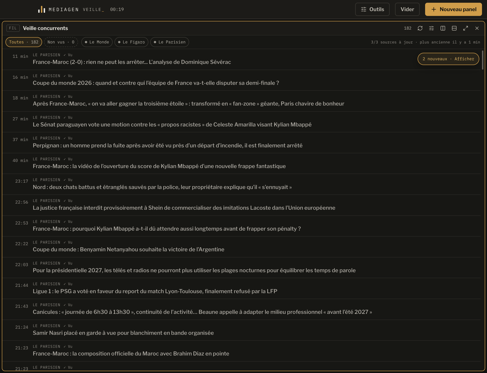

# VibeDeck — MediaGen Veille

Application locale de veille pour journalistes. À la création, chaque panel reçoit un type : **Fil** pour agréger des connecteurs ou **Page web** pour afficher un site réel dans l’application. Les panels se disposent librement côte à côte ou l’un au-dessus de l’autre.



## Ce qui fonctionne

- dashboard composé de panneaux redimensionnables et réorganisables ;
- palette sombre à surfaces neutres, avec contrastes renforcés et amber réservé au focus, aux sélections et aux actions principales ;
- panels « Fil » pour fusionner plusieurs médias dans une chronologie unique ;
- pack de démarrage « Veille concurrents » avec Le Monde, Le Figaro et Le Parisien ;
- premier import traité comme une baseline déjà vue, sans fausse alerte ;
- baseline interclassée par date éditoriale entre les médias, tandis que toute arrivée réellement nouvelle reste au-dessus sans être reclassée rétroactivement ;
- arrivées suivantes insérées automatiquement sans déplacer le viewport ni la sélection, avec un tampon technique indépendant dans chaque panel qui partage la source ;
- états persistants et distincts `Nouveau`, `Vu` et `Ouvert`, avec filtre `Non vus` ;
- fraîcheur calculée sur la source la moins récente et erreurs datées sans masquer le cache ;
- choix explicite Auto, RSS, Atom ou Sitemap pour chaque URL personnalisée ;
- fréquence d’actualisation par défaut configurable par fil, de 30 secondes à 30 minutes ;
- panels « Page web » pour garder un direct, un site ou un outil visible dans l’application ;
- presets pour BFM TV, franceinfo, Le Monde en continu et Google Actualités ;
- ajout d’une page de site, d’un flux RSS/Atom ou d’un Google News Sitemap ;
- reconnaissance directe du Monde, du Figaro et du Parisien ;
- découverte automatique du RSS déclaré par les autres sites ;
- enrichissement des dates du Parisien avec son News Sitemap ;
- recherche locale hybride dans tous les fils, avec résultats FTS5 immédiats puis enrichissement E5 hors ligne, filtre explicite et navigation complète au clavier ;
- filtres par source, recherche et état de lecture, composables sans réordonner la chronologie ;
- lecteur web intégré au clic sur un article, avec option d’ouverture externe ;
- actualisation automatique, cache hors ligne et déduplication ;
- backoff automatique des sources en échec, avec actualisation manuelle toujours disponible ;
- destinations locales/privées et redirections vers un autre site refusées avant chaque requête ; sur une route directe, chaque nom doit aussi résoudre uniquement vers des IP publiques, tandis qu’une route proxy n’accepte que les quatre URL HTTPS exactes utilisées par les trois connecteurs optimisés, puis leurs redirections HTTPS sur le même site, et refuse toute URL personnalisée ;
- réponses réseau lues progressivement et interrompues à 12 Mo, puis XML contrôlé avant parsing : 2 000 entrées, 50 000 jetons structurels — éléments, commentaires, sections CDATA et éventuelle déclaration XML —, 30 000 attributs, profondeur 64, aucune déclaration DOCTYPE/ENTITY ni instruction de traitement non essentielle et URLs limitées à 4 096 caractères ; l’unique déclaration XML autorisée doit être initiale et tenir sur 256 caractères, la découverte HTML est bornée au `head` utile de 256 Kio, 4 000 éléments et 12 000 attributs, tandis que chaque champ riche d’un article est tronqué à 16 Kio avant nettoyage ;
- import/export d’un dashboard de desk sans articles, cookies ni cache web, avec aperçu des volumes et des domaines contactés avant remplacement ;
- sauvegarde automatique de la configuration précédente lors d’un import, conservée à côté du fichier choisi ou dans le dossier local de l’application ;
- export d’un diagnostic local ne contenant ni titre, ni URL consultée, ni cookie ;
- mesure locale de la durée d’usage actif, uniquement lorsque l’application est visible, non réduite et focalisée ;
- stockage strictement local dans SQLite, sans compte, serveur ou collaboration.

Une URL explicitement liée à un RSS de rubrique ou à un sitemap reste prioritaire : elle n’est jamais remplacée par le flux « en continu » du journal.

Les rafraîchissements passent tous par la même file bornée : six téléchargements simultanés au maximum dans l’application, dont deux par domaine. Ajouter un grand pack de sources ne déclenche donc pas une rafale réseau incontrôlée, et deux demandes simultanées pour une même source mutualisent le téléchargement.

Un dashboard peut disposer jusqu’à trois panels sur un même axe horizontal ou vertical. Si le panel ciblé est trop étroit, l’application choisit l’autre orientation ou demande de l’agrandir. Les séparateurs appliquent ensuite une taille minimale réelle de 256 × 176 px à chaque branche, y compris dans un layout imbriqué ou importé. Cette limite maintient les commandes, les états de lecture et les titres utilisables sur l’écran minimal du pilote.

## Lancer l’application

```bash
npm install
npm run dev
```

Raccourcis principaux :

- `Cmd/Ctrl + N` : créer un panel ;
- `Cmd/Ctrl + K` : ouvrir la recherche globale et placer le focus dans la requête ;
- dans la recherche, `↑` / `↓` sélectionnent un résultat ; `Entrée` filtre les fils depuis le champ ou ouvre le résultat sélectionné ;
- `↑` / `↓` : parcourir le fil sous la souris, avec un défilement fluide et continu quand la touche reste enfoncée ;
- `Entrée` : ouvrir l’article ;
- dans le lecteur, `↑` / `↓` : un appui avance d’une page animée (≈ 28 % de recouvrement visuel), maintenir la touche déclenche un défilement rapide continu ;
- double-appui rapide sur `←` / `→` : passer au panel précédent ou suivant ;
- `Alt + ←` / `Alt + →` : déplacer le panel à la position précédente ou suivante, sans glisser-déposer ;
- `R` : actualiser le fil actif ;
- `Échap` : fermer la recherche sans modifier le filtre actif, puis retirer ce filtre depuis le dashboard ; restaurer aussi un panel agrandi ou fermer une fenêtre de réglages.

Le simple déplacement de la souris au-dessus d’un panel lui donne le focus clavier, sauf lorsqu’un champ, un bouton ou une page web possède déjà le clavier ; dans ce cas, un clic explicite évite d’interrompre la saisie. Après la fermeture du lecteur intégré avec `Échap`, la navigation dans le fil reprend directement.

Chaque en-tête de panel permet aussi de diviser l’espace verticalement ou horizontalement, d’agrandir le panel et de le déplacer par glisser-déposer. Les séparateurs se manipulent à la souris ou au clavier.

## Vérifier et construire

```bash
npm test
npm run test:pilot-ui
npm run test:live
npm run build
npm run verify:release
npm run dist:dir
npm run verify:packaged-fuses
npm run test:packaged
```

`test:pilot-ui` construit puis pilote Electron sur deux flux RSS et une base temporaires afin de prouver l’interclassement de la baseline, le retour clavier depuis le lecteur, la navigation et le déplacement avec conservation du focus, la géométrie minimale des panels, l’indépendance des tampons partagés et l’absence de déplacement du viewport lors des arrivées. `test:live` interroge réellement les trois sources de lancement. `dist:dir` produit une application locale dans `release/`, `verify:packaged-fuses` lit directement le binaire Electron produit et `test:packaged` lance ce paquet via son ASAR et son protocole interne. La configuration Windows NSIS est prête, mais doit être validée sur une machine ou une CI Windows avant diffusion.

Les commandes `dist:mac:signed` et `dist:win:signed` imposent la présence des certificats de diffusion. Les jobs signés vérifient les fuses du binaire, génèrent `release/SHA256SUMS.txt`, puis recalculent chaque somme avant de publier les artefacts. La notarisation macOS, la signature Windows et le réseau d’entreprise AFP restent donc des validations externes. Le protocole complet est décrit dans [PILOT_RELEASE.md](./PILOT_RELEASE.md).

## Architecture

Le rendu React ne contacte jamais directement les journaux. Le processus principal Electron télécharge et normalise les flux, puis conserve dashboard, panneaux, sources, articles et métadonnées HTTP dans une base SQLite locale. Une même source est mutualisée entre plusieurs panneaux et un échec réseau ne supprime jamais les articles déjà reçus. La recherche utilise un index dérivé et supprimable dans `semantic-search/` ; le modèle E5 et cet index ne modifient jamais `veille.sqlite3` et ne font pas partie des exports.

La durée d’usage du pilote est comptabilisée localement par intervalles d’une minute et lors des changements de focus ou de visibilité. Chaque intervalle actif est ventilé à la milliseconde entre les journées civiles du fuseau local du poste, y compris au passage de minuit et lors des changements d’heure. Les 400 journées les plus récentes restent détaillées ; les plus anciennes sont fusionnées dans un cumul qui préserve le total exact. Seules des durées et des quantités agrégées sont exportées dans le diagnostic : aucun identifiant de panel ou d’article n’est exporté, afin qu’une URL publique candidate ne permette pas de réidentifier ce qui a été ouvert.

Les panels Page web et le lecteur d’article utilisent des vues natives Electron isolées du reste de l’application, sans accès Node, avec permissions et téléchargements refusés par défaut. Les liens demandant une nouvelle fenêtre restent dans la page courante ; l’ouverture externe demeure une action explicite. Leur position suit le layout React, tandis que leur contenu reste un vrai site interactif. À la fermeture d’une vue, ses service workers sont arrêtés sans effacer les cookies, le stockage local ou le cache HTTP utiles aux autres vues ; les origines encore ouvertes restent intactes.

En production, l’interface est chargée par le protocole interne sécurisé `mediagen-app://` et non par `file://`. Le paquet désactive notamment l’exécution d’Electron comme Node, les options Node injectées par l’environnement et les privilèges supplémentaires du protocole fichier ; l’intégrité de l’ASAR et le chiffrement des cookies sont activés. La vérification des fuses se fait sur le binaire réellement empaqueté, pas seulement sur la configuration du projet.

Le type de panel est un modèle extensible : les futurs panels « Liste X », « Feed X » ou « Compte X » pourront rejoindre le sélecteur sans modifier le moteur de layout.

Les connecteurs génériques couvrent RSS, Atom et News Sitemap. Les règles spécialisées sont regroupées dans `electron/feed-engine.mjs` afin d’ajouter progressivement d’autres médias sans modifier l’interface.

## Périmètre et droits

Cette V0 sert à valider le produit localement. Les éditeurs peuvent restreindre l’usage professionnel ou collectif de leurs flux. Avant un pilote AFP, il faut vérifier les licences de syndication existantes ou obtenir les autorisations nécessaires auprès des publications concernées. Aucun contournement de protection anti-bot n’est implémenté.
